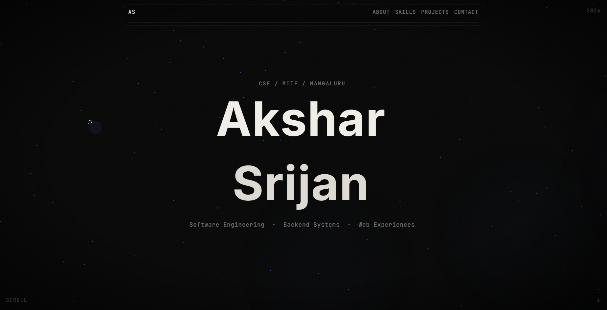

  # Akshar Srijan | Software Engineering Portfolio 

[](https://akshars07.github.io)
[](https://akshars07.github.io)
[](https://akshars07.github.io)
[](https://akshars07.github.io)

> A high-performance, dark-themed personal portfolio built to showcase my projects, technical skills, and engineering journey. 

## 🌐 Live Preview
**Check out the live site here:** [akshars07.github.io](https://akshars07.github.io)

**

---

## 👨‍💻 About Me
I am a second-year engineering student at Mangalore Institute of Technology and Engineering (MITE) specializing in **Computer Science**, on **Internet of Things (IoT)**, **Cybersecurity**, and **Blockchain Technology**. I am passionate about software prototyping, logic formulation.

---

## 🛠️ Tech Stack & Architecture
This portfolio was built natively without heavy UI frameworks to prioritize load speed, DOM control, and complex animation sequencing.

* **Markup & Styling:** HTML5, Modern CSS (Grid, Flexbox, Noise & Vignette overlays)
* **Interactivity:** Vanilla JavaScript
* **Animation Engine:** GSAP (GreenSock Animation Platform) & ScrollTrigger
* **Smooth Scrolling:** Lenis.js
* **Typography:** Inter & JetBrains Mono
---

## ✨ Key Features
* **Interactive Canvas:** Features a dynamic `<canvas>` background and ambient floating orbs.
* **Custom Cursor System:** Implements a custom `.cursor` and `.cursor-trail` that reacts to user navigation.
* **Staggered Text Reveals:** Uses GSAP for buttery-smooth, letter-by-letter text splitting animations on the hero section (`#name` and `.char-wrap`).
* **Modern Layout:** Clean, dark-mode aesthetic with fixed corner navigational elements, magnetic links, and a scroll-progress bar.

---

## 🚀 Current Focus & Skills
* **Languages:** Python, C++, C, Java, HTML, CSS.
* **Project Status:** The project vault is currently in progress. My software portfolio is brewing in the background, and something clean and modern is on the way.

---
---

## ⚖️ Usage & Attribution
You are welcome to fork this repository and use this code as a template for your own personal portfolio. However, **you must give explicit credit**. 

If you use this design or codebase, you must:
1. Keep the original MIT `LICENSE` file intact in your repository.
2. Include a visible attribution link in your site's footer pointing back to this repository (e.g., *"Template adapted from [Akshar Srijan](https://github.com/AksharS07/AksharS07.github.io)"*).

## 💻 Local Installation & Setup
If you want to explore the code locally, feel free to fork or clone this repository.

1. **Clone the repository:**
   ```bash
   git clone [https://github.com/AksharS07/AksharS07.github.io.git](https://github.com/AksharS07/AksharS07.github.io.git)
